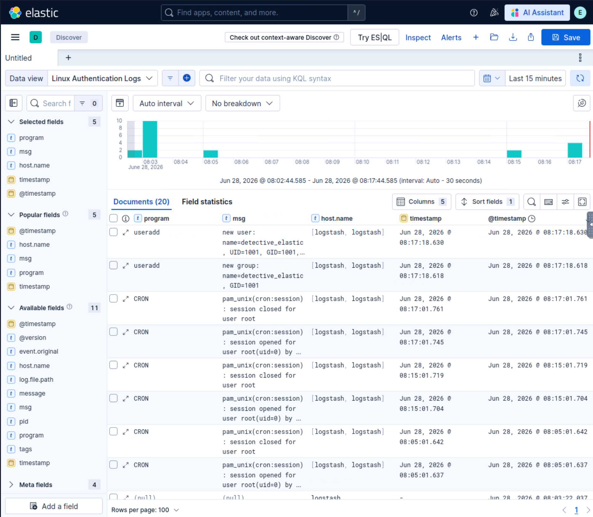

# Elastic and Wazuh Detection Operations Workbook

**Public portfolio artifact** | **Controlled lab environment** | **Last updated: 2026-07-01**

This workbook demonstrates practical Elastic Stack and Wazuh detection-operations work: building a Logstash ingestion pipeline, validating parsed events in Kibana, engineering custom Wazuh rules, using KQL and Lucene for investigation pivots, and reconstructing a web-application compromise from Apache log evidence.

The artifact is built for reviewer inspection. The root README provides the visual proof path. The section docs provide deeper technical walkthroughs. The source files preserve the exact pipeline, rule, and query artifacts.

## What this proves

| Capability | Evidence |
|---|---|
| Log ingestion and parsing | Logstash pipeline reads Linux auth logs, parses fields with Grok, normalizes timestamps, and sends events to Elasticsearch. |
| Detection rule engineering | Wazuh logtest output is used to inspect decoded fields, troubleshoot a failed custom rule, correct field logic, and validate child rules. |
| SIEM query fluency | KQL and Lucene are used for exact filters, wildcards, boolean pivots, ranges, regex, fuzzy search, and proximity search. |
| Attack reconstruction | Apache log evidence is used to identify attacker source, tooling sequence, brute force, upload behavior, web shell execution, LFI, and database access. |
| Analyst reporting | Screenshots, source files, query ledgers, and proof maps are organized into a reviewer-facing evidence trail. |

## Visual proof highlights

### 1. Parsed Linux authentication events in Kibana

Reviewer takeaway:

The Logstash pipeline is not only configured. It is validated through parsed Linux authentication events visible in Kibana, including structured fields and normalized timestamps.

### 2. Wazuh decoded-field troubleshooting

Reviewer takeaway:

The Wazuh rule-engineering workflow shows field-level troubleshooting. The first custom rule failed because it targeted the wrong decoded field. Decoder output revealed the correct field to match.

### 3. Corrected custom Wazuh rule validation

Reviewer takeaway:

After correcting the field from `audit.cwd` to `audit.directory.name`, custom rule 100002 fired as intended. This demonstrates detection troubleshooting, not only rule writing.

### 4. Lucene regex investigation pivot

Reviewer takeaway:

The Elastic investigation section demonstrates practical Lucene usage against analyst comments and affected file names. The section also documents a corrected query path where structured incident type and analyst comment text produced different result counts.

### 5. Attacker identification through field statistics

Reviewer takeaway:

The Slingshot investigation identifies the attacker source through field-statistics dominance rather than assumption. The dominant source produced 2,565 of 3,028 events.

### 6. Web shell command evidence

Reviewer takeaway:

The attack reconstruction follows the sequence from enumeration and brute force into upload activity and web shell execution. The first observed command was identified through Apache log evidence.

## Fast review path

| Review area | Start here |
|---|---|
| Reviewer proof map | [reviewer-proof-map.md](reviewer-proof-map.md) |
| Section docs | [docs/README.md](docs/README.md) |
| Logstash config | [configs/logstash/auth.conf](configs/logstash/auth.conf) |
| Wazuh rules | [configs/wazuh/local_rules.xml](configs/wazuh/local_rules.xml) |
| Elastic query ledger | [queries/section-03-kql-lucene-queries.md](queries/section-03-kql-lucene-queries.md) |
| Slingshot query ledger | [queries/section-04-slingshot-investigation-queries.md](queries/section-04-slingshot-investigation-queries.md) |

## Detection operations map

| Layer | Section | Analyst value |
|---|---|---|
| Pipeline | [Section 01 - Logstash Collection, Processing, and Transformation](docs/01-logstash-collection-processing-transformation.md) | Turns raw Linux authentication logs into parsed, timestamp-normalized events in Elasticsearch. |
| Detection | [Section 02 - Wazuh Custom Alert Rule Engineering](docs/02-wazuh-custom-alert-rule-engineering.md) | Turns decoded event fields into custom alert logic and validated rule behavior. |
| Query | [Section 03 - Elastic Query Languages and Investigation Patterns](docs/03-elastic-query-languages-investigation-patterns.md) | Uses KQL and Lucene to filter, pivot, and validate investigation evidence. |
| Investigation | [Section 04 - Slingshot Attack Reconstruction](docs/04-slingshot-attack-reconstruction.md) | Reconstructs attacker behavior from Apache log evidence. |
| Synthesis | [Section 05 - Advanced ELK Recap and Analyst Lessons](docs/05-advanced-elk-recap-analyst-lessons.md) | Connects pipeline, detection, query, and reconstruction work into transferable SOC lessons. |

## Section overview

### Section 01 - Logstash Collection, Processing, and Transformation

This section demonstrates the pipeline layer. Logstash was installed, enabled, and validated as a running service. A custom pipeline ingested Linux authentication logs, parsed fields with Grok, normalized timestamps with the Date filter, and sent structured events to Elasticsearch for validation in Kibana.

Supporting files:

- [Section 01 deep dive](docs/01-logstash-collection-processing-transformation.md)
- [Logstash auth pipeline](configs/logstash/auth.conf)

### Section 02 - Wazuh Custom Alert Rule Engineering

This section demonstrates the detection logic layer. Wazuh logtest output was used to inspect decoder results, validate default rule behavior, troubleshoot a custom auditd rule, correct a field mismatch, and validate fine-tuned child rules.

Supporting files:

- [Section 02 deep dive](docs/02-wazuh-custom-alert-rule-engineering.md)
- [Wazuh local rules](configs/wazuh/local_rules.xml)

### Section 03 - Elastic Query Languages and Investigation Patterns

This section demonstrates investigation search patterns in Kibana using KQL and Lucene. The workflow covers exact field filtering, wildcard expansion, boolean logic, date and numeric ranges, regex, fuzzy search, and proximity search.

Supporting files:

- [Section 03 deep dive](docs/03-elastic-query-languages-investigation-patterns.md)
- [KQL and Lucene query ledger](queries/section-03-kql-lucene-queries.md)

### Section 04 - Slingshot Attack Reconstruction

This section demonstrates applied SOC investigation and attack reconstruction using Apache log evidence in Elastic. The investigation follows field discovery, attacker identification, user-agent analysis, enumeration, brute-force authentication, upload activity, web shell execution, LFI-style access, and phpMyAdmin database/table access.

Supporting files:

- [Section 04 deep dive](docs/04-slingshot-attack-reconstruction.md)
- [Slingshot investigation query ledger](queries/section-04-slingshot-investigation-queries.md)

### Section 05 - Advanced ELK Recap and Analyst Lessons

The synthesis section converts the workbook into transferable SOC lessons. The core skill is not memorizing syntax. The core skill is turning raw events into validated fields, validated fields into detections, detections into focused queries, and focused queries into defensible incident narratives.

Supporting file:

- [Section 05 analyst lessons](docs/05-advanced-elk-recap-analyst-lessons.md)

## Scope

This workbook demonstrates hands-on Elastic and Wazuh workflows in controlled lab environments. It does not claim production ownership of an enterprise SIEM deployment. Sensitive authentication material and private exercise artifacts were excluded or sanitized before publication.