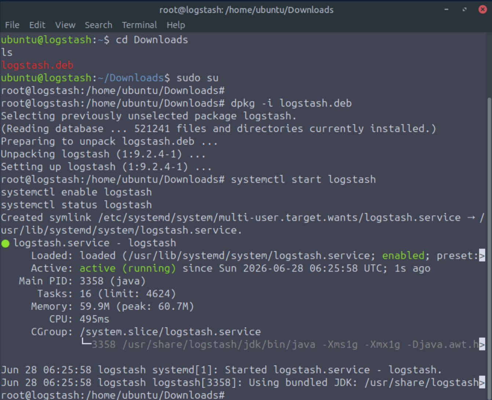
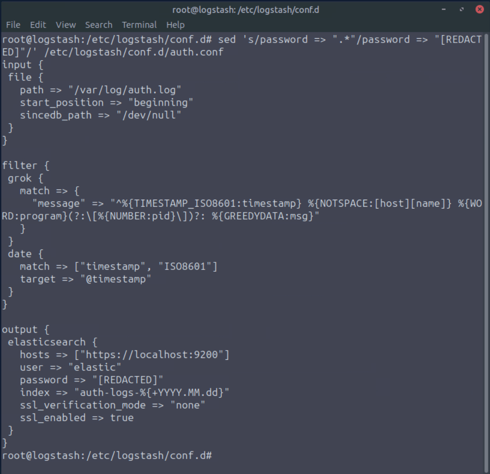
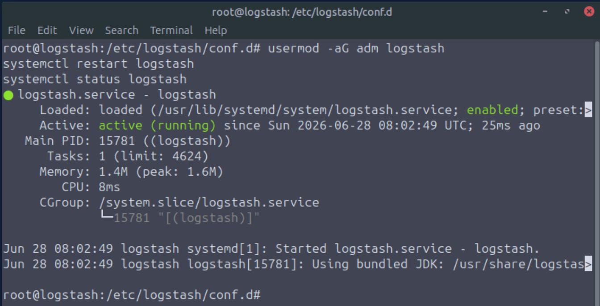
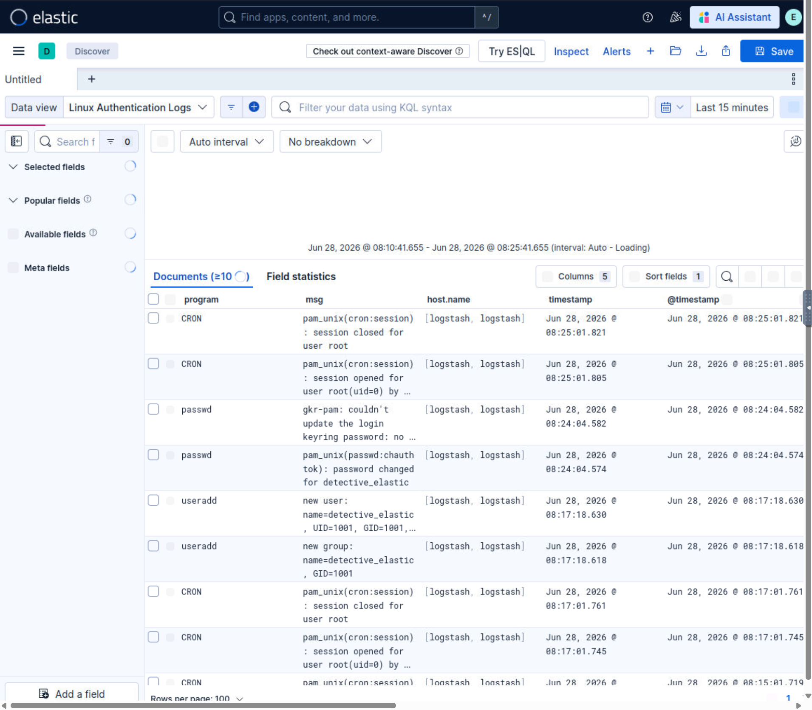

# Section 01 - Logstash Collection, Processing, and Transformation

[README](../README.md) | [Docs Index](README.md) | [Proof Map](../reviewer-proof-map.md)

## Purpose

This section demonstrates the Elastic pipeline layer.

Workflow proven:

| Step | Purpose |
|---|---|
| Collect | Read Linux authentication logs from `/var/log/auth.log`. |
| Parse | Use Grok to extract structured fields from raw log messages. |
| Normalize | Use the Date filter to write source-event time into `@timestamp`. |
| Route | Send processed events to Elasticsearch under an `auth-logs-*` index pattern. |
| Validate | Confirm parsed events in Kibana Discover. |

## Evidence summary

Logstash was installed from a local package, enabled as a service, and validated as active. A custom pipeline then read Linux authentication logs, parsed authentication messages with Grok, normalized timestamps with the Date filter, and sent processed events to Elasticsearch.

The pipeline was validated in Kibana using generated Linux authentication activity.

## Visual walkthrough

### 1. Logstash service validation

Reviewer takeaway:

Logstash was installed, enabled, started, and validated as an active service before pipeline validation.

Visible proof includes:

| Evidence | Value |
|---|---|
| `logstash.deb` present | Local package installation source. |
| `dpkg -i logstash.deb` | Package installation workflow. |
| `systemctl start logstash` | Service start. |
| `systemctl enable logstash` | Service persistence across boot. |
| `systemctl status logstash` | Active/running validation. |

### 2. Public-safe auth pipeline configuration

Reviewer takeaway:

The pipeline reads Linux authentication logs, parses fields with Grok, normalizes event time, and sends events to Elasticsearch.

Key pipeline elements:

| Pipeline block | Evidence |
|---|---|
| Input | File input reads `/var/log/auth.log`. |
| Start behavior | `start_position` set to `beginning`. |
| State behavior | `sincedb_path` set to `/dev/null` for repeatable lab ingestion. |
| Parsing | Grok extracts `timestamp`, `host.name`, `program`, `pid`, and `msg`. |
| Time normalization | Date filter targets `@timestamp`. |
| Output | Elasticsearch output writes to `auth-logs-%{+YYYY.MM.dd}`. |
| Safety | Elasticsearch password is redacted. |

Technical source:

- [Logstash auth pipeline](../configs/logstash/auth.conf)

### 3. Pipeline restart validation

Reviewer takeaway:

The Logstash service remained active after the custom pipeline was added and file-read permissions were adjusted.

Important operational detail:

| Step | Why it matters |
|---|---|
| `usermod -aG adm logstash` | Allows the Logstash service account to read authentication logs. |
| `systemctl restart logstash` | Reloads the pipeline after configuration changes. |
| `systemctl status logstash` | Confirms the service is active after the change. |

### 4. Parsed user creation event validation

Reviewer takeaway:

The pipeline is not proven by configuration alone. It is proven when parsed fields appear in Kibana.

Visible validation:

| Field or value | Meaning |
|---|---|
| Data view: Linux Authentication Logs | Kibana can search the generated auth-log index. |
| `program: useradd` | The auth event was parsed into a structured program field. |
| `host.name` | Host context was extracted. |
| `msg` | Remaining authentication event details were preserved. |
| `@timestamp` | Source event time was normalized into the Elastic timestamp field. |

### 5. Parsed password-change event validation

Reviewer takeaway:

A second generated authentication event validated that the pipeline continued parsing Linux auth activity beyond a single event type.

Visible validation:

| Field or value | Meaning |
|---|---|
| `program: passwd` | Password-change activity was parsed into the program field. |
| `msg` includes password-change log message | The event body remained analyst-readable. |
| `@timestamp` populated | Timestamp normalization remained functional. |

## Technical source

| File | Purpose |
|---|---|
| [configs/logstash/auth.conf](../configs/logstash/auth.conf) | Public-safe Logstash pipeline configuration. |

## Key technical evidence

| Evidence | Value |
|---|---|
| Logstash version | 9.2.4 |
| Pipeline file path | `/etc/logstash/conf.d/auth.conf` |
| Input source | `/var/log/auth.log` |
| Filters | Grok and Date |
| Output index pattern | `auth-logs-%{+YYYY.MM.dd}` |
| Kibana data view | Linux Authentication Logs |
| Test activity | `useradd` and `passwd` events |

## Complete evidence reference

| Screenshot | What it proves |
|---|---|
| 01-logstash-installed-service-active.png | Logstash installation and active service validation. |
| 02-logstash-auth-conf-redacted-pipeline-config.png | Public-safe Logstash pipeline configuration. |
| 03-logstash-auth-pipeline-service-restarted-active.png | Service restart and active validation after pipeline configuration. |
| 04-kibana-auth-logs-useradd-event-validation.png | Parsed `useradd` event validation in Kibana. |
| 05-kibana-auth-logs-passwd-event-validation.png | Parsed `passwd` event validation in Kibana. |

## Analyst lessons

- Logstash solves pipeline processing, not just log forwarding.
- The input block defines where events come from.
- The filter block shapes, parses, normalizes, and enriches events.
- The output block defines where processed events go.
- Permission issues matter when services need to read protected log files.
- A pipeline is not proven until parsed fields are visible in Elasticsearch or Kibana.

## Reviewer takeaway

This section proves hands-on Elastic pipeline workflow: service validation, file input configuration, Grok parsing, timestamp normalization, Elasticsearch output, and Kibana validation.