# Section 02 - Wazuh Custom Alert Rule Engineering

[README](../README.md) | [Docs Index](README.md) | [Proof Map](../reviewer-proof-map.md)

## Purpose

This section demonstrates the Wazuh detection logic layer.

Workflow proven:

| Step | Purpose |
|---|---|
| Decode | Use Wazuh logtest to inspect how raw events become decoded fields. |
| Match | Observe default and specific rule matches. |
| Chain | Validate parent-child rule behavior with `if_sid`. |
| Troubleshoot | Compare intended rule logic against decoded field output. |
| Correct | Update the rule to match the correct decoded field. |
| Tune | Add child rules for suspicious extension, failed creation, suspicious filename, and exception logic. |
| Validate | Confirm expected rule matches with reviewable alert evidence. |

## Evidence summary

This section proves more than custom rule creation. It proves the rule-engineering loop: inspect decoded fields, test rules, identify a field mismatch, correct the rule, and validate alert behavior.

The strongest proof chain is the auditd custom rule correction. The original custom rule matched `audit.cwd`, but decoded-field evidence showed the target directory value appeared in `audit.directory.name`. Updating the rule to match `audit.directory.name` produced the intended custom rule match.

## Visual walkthrough

### 1. Wazuh logtest decoder and rule phases

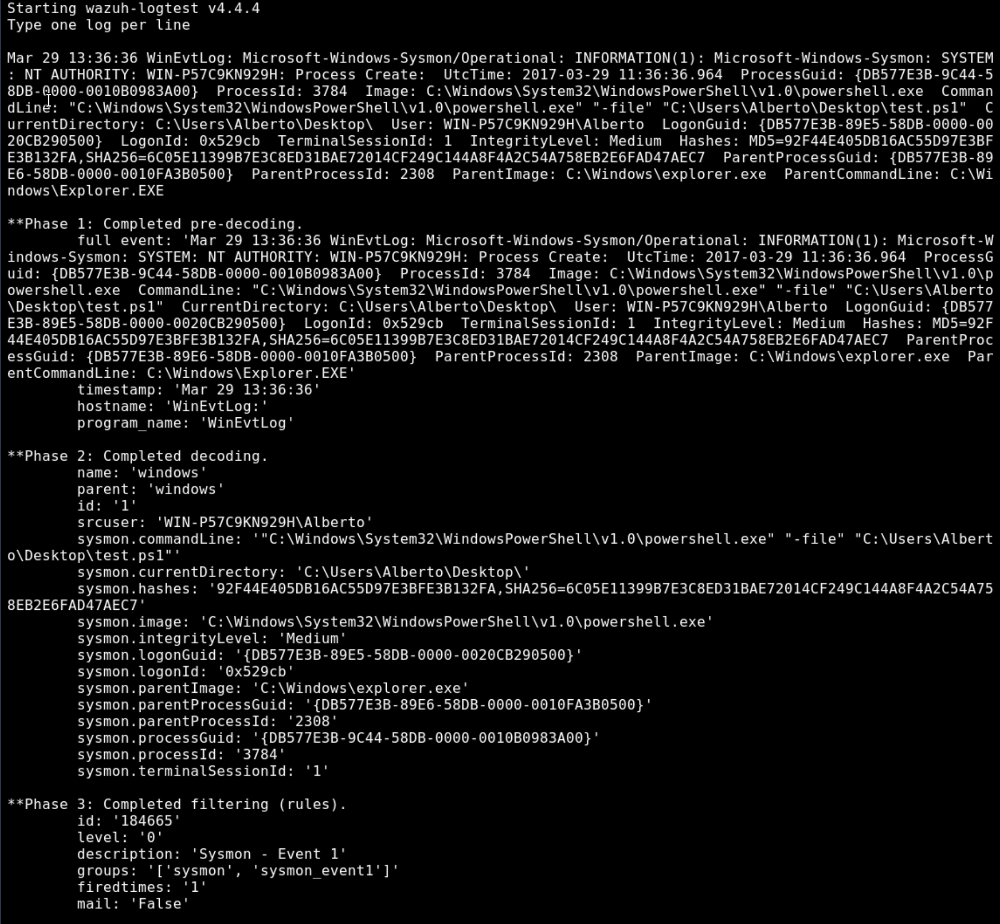

Reviewer takeaway:

Wazuh logtest shows the event moving through pre-decoding, decoding, and rule filtering. This provides visibility into how raw log data becomes alert logic.

Visible proof includes:

| Evidence | Value |
|---|---|
| Wazuh logtest output | Rule-testing workflow. |
| Phase 1 pre-decoding | Initial event parsing. |
| Phase 2 decoding | Decoded field extraction. |
| Phase 3 filtering | Rule evaluation. |
| Sysmon Event 1 rule match | Baseline rule validation. |

### 2. Specific suspicious-process rule matches

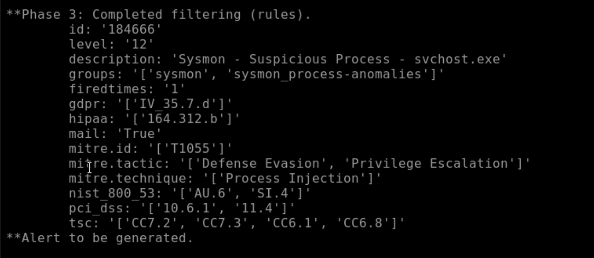

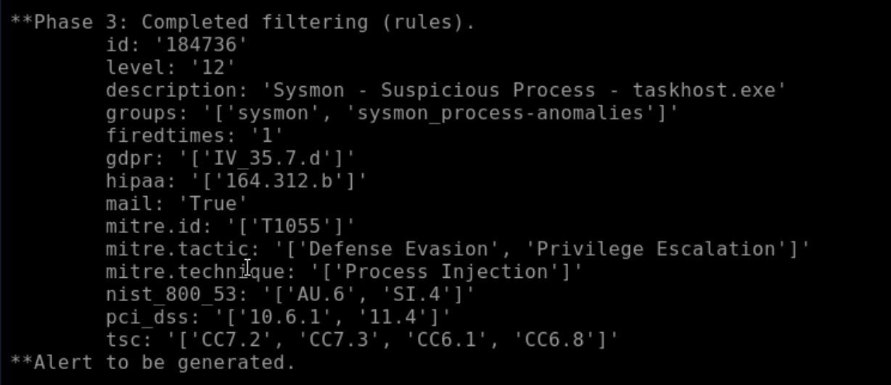

Reviewer takeaway:

Changing the decoded process image produced different specific rule matches in the same detection family.

Visible proof includes:

| Rule | Evidence value |
|---|---|
| 184666 | Suspicious `svchost.exe` process match. |
| 184736 | Suspicious `taskhost.exe` process match. |
| MITRE T1055 mapping | Detection is linked to process injection behavior. |
| Alert generation | The rule logic produced reviewable alert output. |

### 3. Parent-child rule order with if_sid

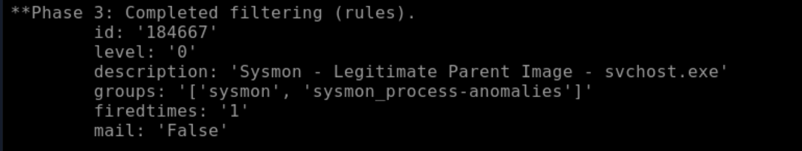

Reviewer takeaway:

`if_sid` creates dependency chains where child rules refine earlier matches. This is important for building layered detection logic instead of isolated one-off rules.

Visible proof includes:

| Evidence | Value |
|---|---|
| Parent rule dependency | Child logic depends on an earlier rule match. |
| Refined rule behavior | A broader suspicious rule can be narrowed or reclassified. |
| Rule ordering | Detection behavior depends on rule relationship, not only field matching. |

### 4. Initial custom auditd rule

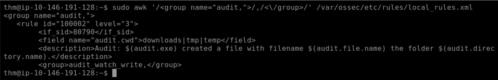

Reviewer takeaway:

A local custom auditd rule was added to extend default Wazuh behavior.

Initial intended logic:

| Rule element | Purpose |
|---|---|
| Rule ID 100002 | Custom local rule identifier. |
| Level 3 | Low-severity baseline custom match. |
| `if_sid` 80790 | Extends the default file-creation rule. |
| Field condition | Intended to match suspicious directory names. |
| Description | Produces analyst-readable alert context. |

Technical source:

- [Wazuh local rules](../configs/wazuh/local_rules.xml)

### 5. Default rule fires before correction

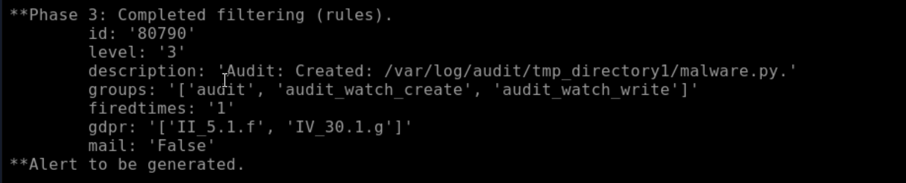

Reviewer takeaway:

The test event initially triggered default rule 80790 instead of custom rule 100002. This showed the custom logic was not matching as intended.

Visible proof includes:

| Evidence | Value |
|---|---|
| Rule 80790 | Default auditd file-creation rule fired. |
| Custom rule absence | Rule 100002 did not match yet. |
| Alert generated | The event was valid, but the custom rule condition failed. |

### 6. Decoded-field troubleshooting

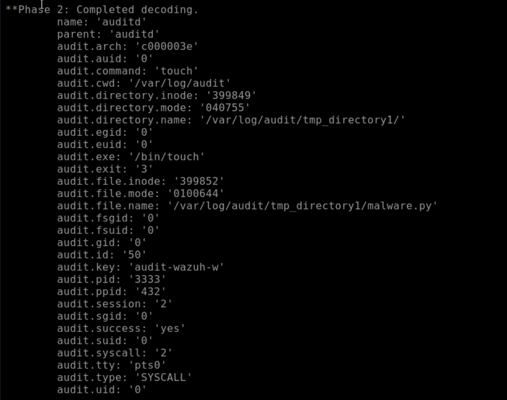

Reviewer takeaway:

The decoded fields explained why the custom rule failed. The target string was not in `audit.cwd`; it was present in `audit.directory.name` and `audit.file.name`.

Troubleshooting finding:

| Decoded field | Observed meaning |
|---|---|
| `audit.cwd` | Current working directory value did not contain the intended directory string. |
| `audit.directory.name` | Directory path contained the target directory pattern. |
| `audit.file.name` | File path also contained the target directory pattern. |

Analyst lesson:

A rule can be syntactically valid and still fail if it targets the wrong decoded field.

### 7. Corrected field selection

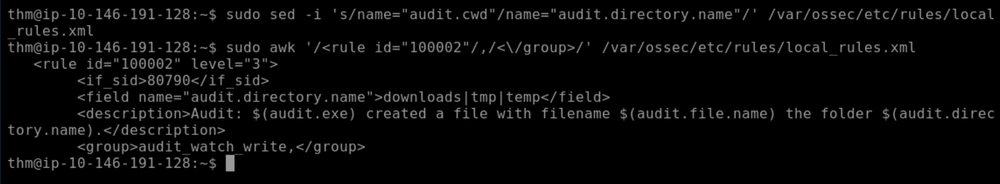

Reviewer takeaway:

The custom rule was corrected to match `audit.directory.name`.

Correction summary:

| Before | After |
|---|---|
| `audit.cwd` | `audit.directory.name` |

Why it matters:

The correction aligned rule logic with actual decoded event structure.

### 8. Corrected custom rule validation

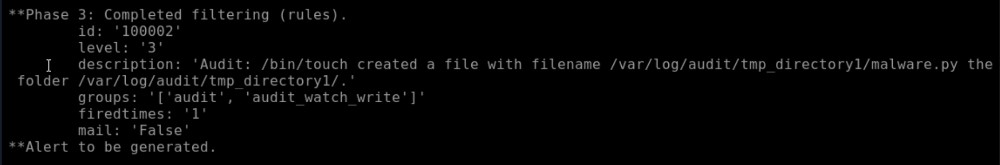

Reviewer takeaway:

After the field correction, rule 100002 fired as intended.

Visible proof includes:

| Evidence | Value |
|---|---|
| Rule 100002 | Corrected custom rule matched. |
| Alert generated | Custom detection produced reviewable output. |
| File and directory values | Alert description contained relevant event context. |

### 9. Fine-tuned child-rule chain

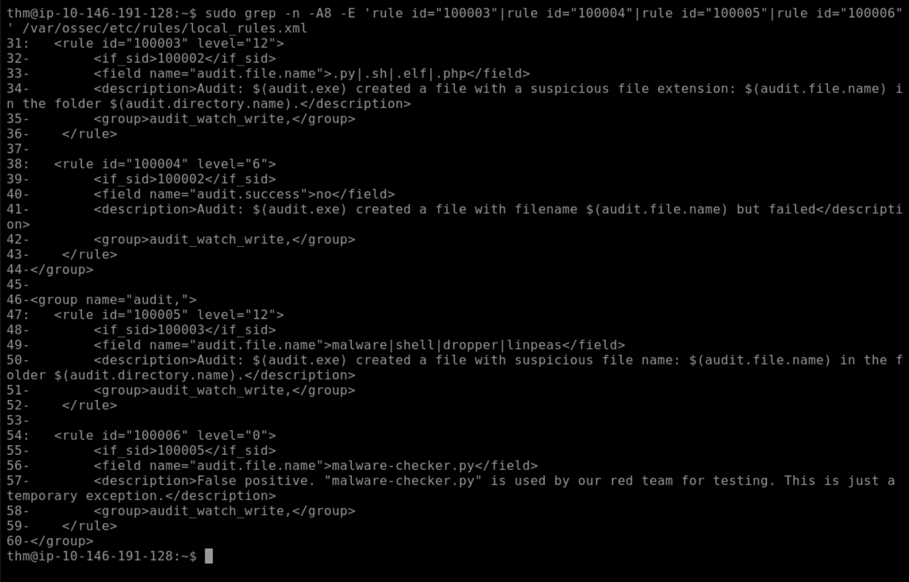

Reviewer takeaway:

Child rules were added to refine the baseline custom rule. The rule chain can escalate suspicious conditions, classify failed behavior, identify suspicious names, and suppress a specific exception.

Child-rule summary:

| Rule | Purpose |
|---|---|
| 100003 | Escalates suspicious file extensions. |
| 100004 | Identifies failed file creation. |
| 100005 | Escalates suspicious filename keywords. |
| 100006 | Suppresses a specific false-positive exception. |

### 10. Suspicious extension validation

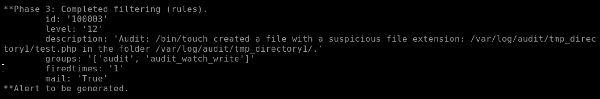

Reviewer takeaway:

A suspicious file extension triggered child rule 100003.

Visible proof includes:

| Evidence | Value |
|---|---|
| Rule 100003 | Suspicious extension rule fired. |
| Level 12 | Higher-severity classification. |
| `.php` filename | Extension condition matched expected activity. |

### 11. Suspicious filename validation

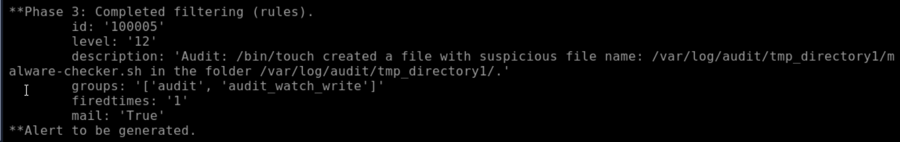

Reviewer takeaway:

A suspicious filename keyword triggered child rule 100005.

Visible proof includes:

| Evidence | Value |
|---|---|
| Rule 100005 | Suspicious filename rule fired. |
| Level 12 | Higher-severity classification. |
| `malware` keyword | Filename condition matched expected activity. |

## Technical source

| File | Purpose |
|---|---|
| [configs/wazuh/local_rules.xml](../configs/wazuh/local_rules.xml) | Public-safe custom Wazuh rule chain. |

## Key technical evidence

| Evidence | Value |
|---|---|
| Tool | wazuh-logtest v4.4.4 |
| Default auditd rule | 80790 |
| Corrected custom rule | 100002 |
| Suspicious extension child rule | 100003 |
| Failed creation child rule | 100004 |
| Suspicious filename child rule | 100005 |
| False-positive exception child rule | 100006 |
| Corrected field | `audit.directory.name` |
| Original mismatch field | `audit.cwd` |

## Complete evidence reference

| Screenshot | What it proves |
|---|---|
| 06-wazuh-sysmon-decoder-logtest-validation.png | Wazuh logtest decoding and rule filtering. |
| 07-wazuh-sysmon-svchost-rule-match-validation.png | Specific Sysmon suspicious-process rule match. |
| 08-wazuh-sysmon-taskhost-rule-match-validation.png | Alternate suspicious-process rule match. |
| 09-wazuh-sysmon-if-sid-parent-child-rule-order-validation.png | Parent-child rule order using `if_sid`. |
| 10-wazuh-local-audit-custom-rule-100002-definition.png | Initial custom local audit rule definition. |
| 11-wazuh-auditd-default-rule-80790-before-field-correction.png | Default rule match before custom-rule correction. |
| 12-wazuh-auditd-decoded-fields-for-custom-rule-troubleshooting.png | Decoded fields used to troubleshoot the custom rule. |
| 13-wazuh-local-audit-custom-rule-100002-field-correction.png | Corrected field selection. |
| 14-wazuh-auditd-custom-rule-100002-corrected-validation.png | Corrected custom rule match. |
| 15-wazuh-auditd-fine-tuned-custom-rule-chain-definition.png | Fine-tuned child-rule chain. |
| 16-wazuh-auditd-test-php-rule-match-validation.png | Suspicious extension rule match. |
| 17-wazuh-auditd-malware-checker-sh-rule-match-validation.png | Suspicious filename rule match. |

## Analyst lessons

- Decoder output must be inspected before rule logic is trusted.
- A rule can be syntactically valid and still fail if it matches the wrong decoded field.
- Default rules can be extended instead of recreated from scratch.
- `if_sid` creates parent-child detection chains.
- Fine-tuning can escalate, suppress, or reclassify alerts.
- False-positive exceptions must match the exact exception condition.
- A detection is proven when the rule fires against expected activity and produces reviewable alert evidence.

## Reviewer takeaway

This section proves practical Wazuh custom alert-rule engineering: decoder inspection, default-rule extension, custom rule troubleshooting, field correction, child-rule tuning, and validation.