# Section 03 - Elastic Query Languages and Investigation Patterns

[README](../README.md) | [Docs Index](README.md) | [Proof Map](../reviewer-proof-map.md)

## Purpose

This section demonstrates the Elastic query layer.

Workflow proven:

| Query skill | Analyst value |
|---|---|
| Exact field filtering | Find incidents involving a specific artifact. |
| Wildcard matching | Expand from a single artifact to a file family or naming pattern. |
| Boolean logic | Combine asset type, analyst notes, and user context. |
| Numeric ranges | Prioritize by severity or bounded ID ranges. |
| Date boundaries | Constrain investigations by time. |
| Lucene regex | Search flexible text patterns in fields and comments. |
| Fuzzy search | Find near matches in analyst notes. |
| Proximity search | Find related concepts near each other without exact phrase matching. |

## Evidence summary

This section uses KQL and Lucene in Kibana Discover to filter incident data, pivot across nested fields, validate result counts, and extract analyst-useful evidence.

The strongest analyst lesson is that similar concepts can return different counts depending on which evidence field is queried. A structured incident type and analyst comment text are not interchangeable.

## Visual walkthrough

### 1. Exact nested-field filtering

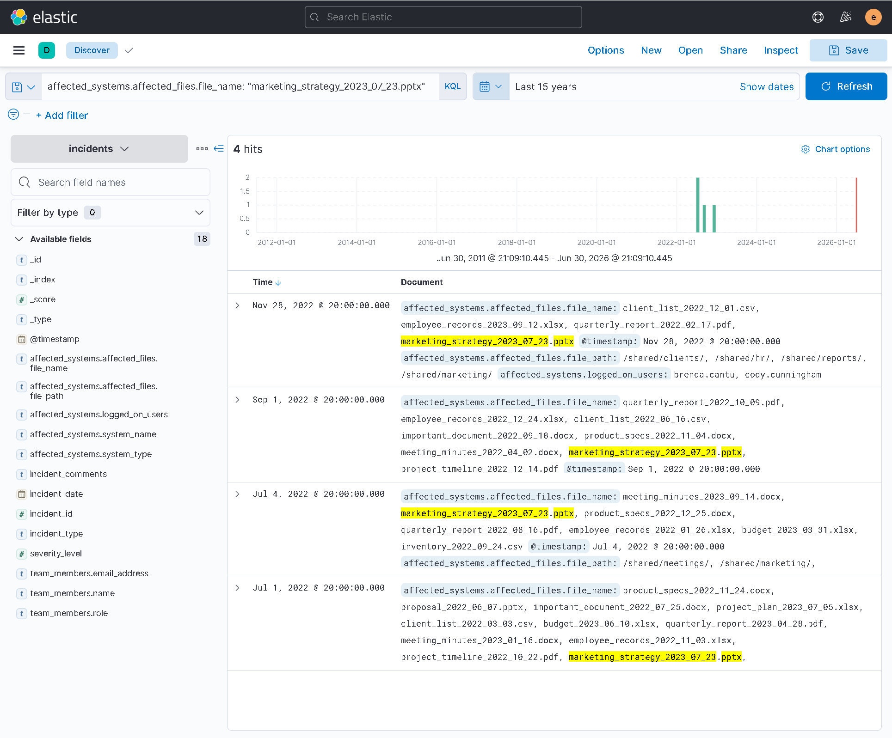

Reviewer takeaway:

KQL exact field filtering can identify all incidents involving a specific file.

Query evidence:

| Pattern | Exact query | Result |
|---|---|---|
| Exact nested-field filtering | `affected_systems.affected_files.file_name: "marketing_strategy_2023_07_23.pptx"` | 4 hits |

### 2. Wildcard file-family matching

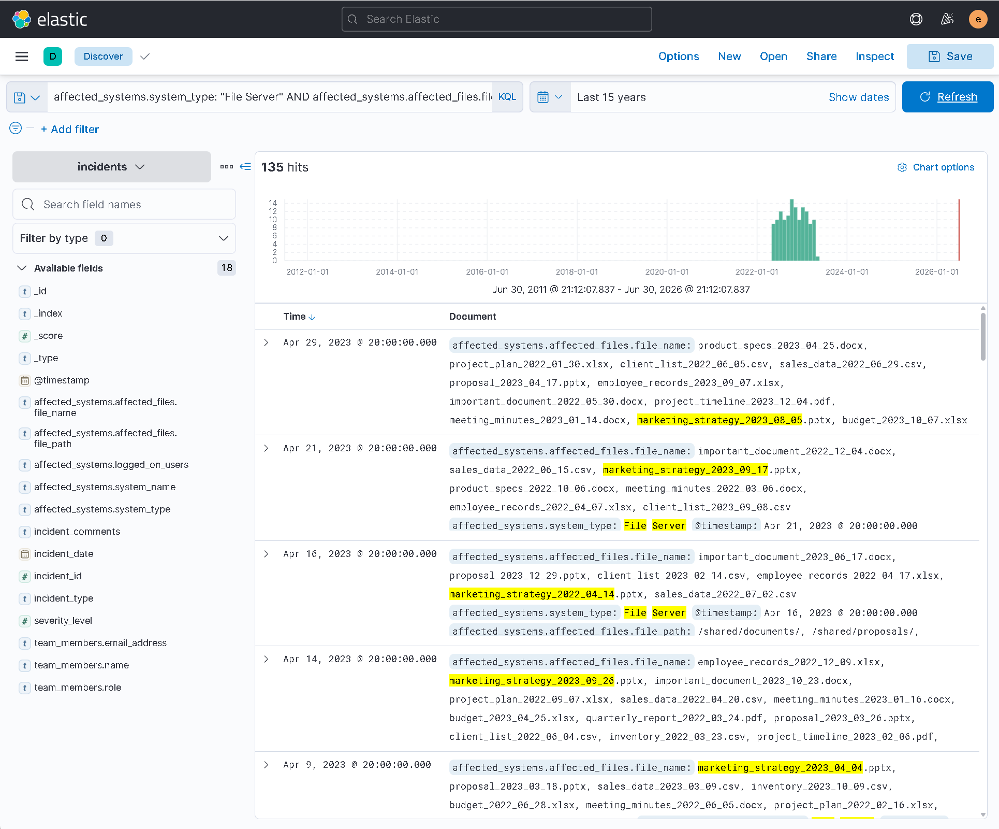

Reviewer takeaway:

Wildcard matching broadened the investigation from one known file to a larger naming pattern constrained to File Server systems.

Query evidence:

| Pattern | Exact query | Result |
|---|---|---|
| KQL wildcard file-family filtering | `affected_systems.system_type: "File Server" AND affected_systems.affected_files.file_name: marketing_strategy*` | 135 hits |

### 3. Boolean and nested-field pivoting

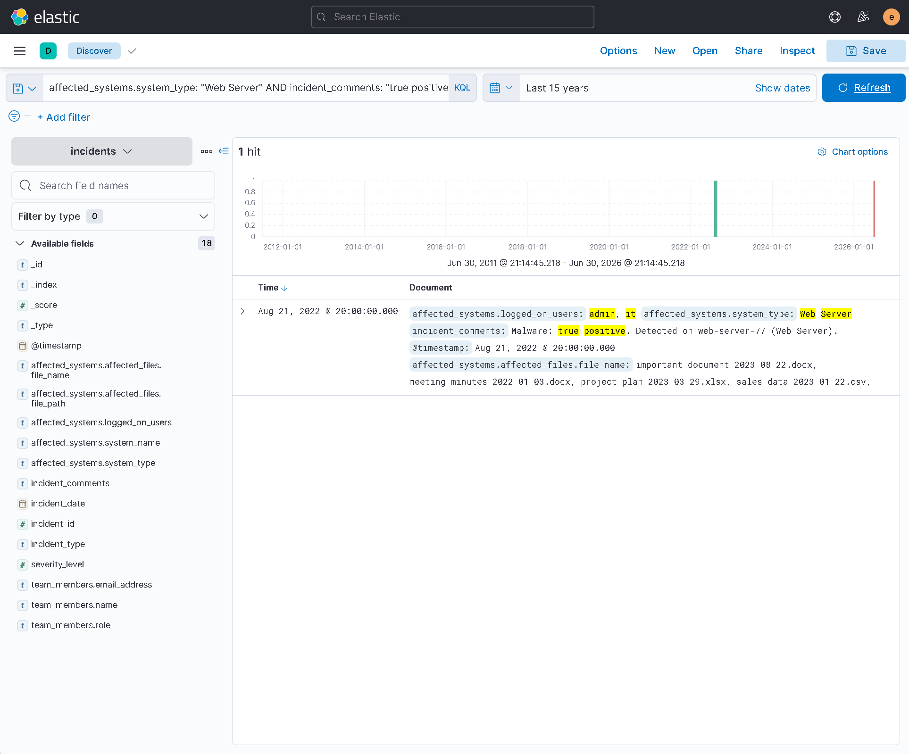

Reviewer takeaway:

Boolean filtering can combine affected asset type, analyst comment evidence, and logged-on user context to isolate a specific host.

Query evidence:

| Pattern | Exact query | Result |
|---|---|---|
| KQL boolean pivot for affected web server | `affected_systems.system_type: "Web Server" AND incident_comments: "true positive" AND affected_systems.logged_on_users: ("admin" AND "it")` | 1 hit; web-server-77 |

### 4. Lucene regex against analyst comments and file names

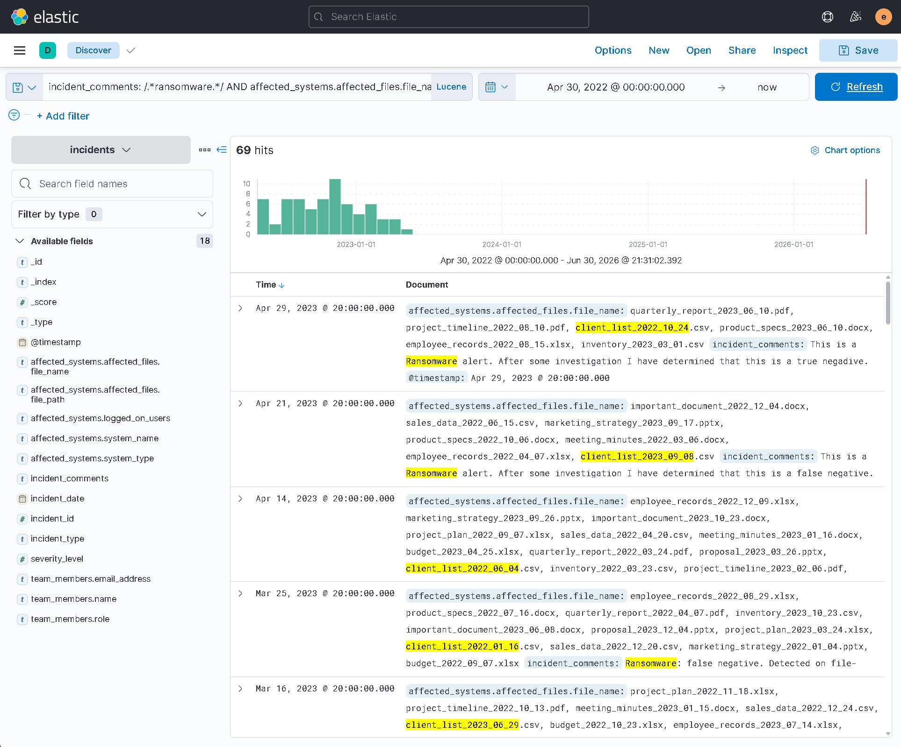

Reviewer takeaway:

Lucene regex supports flexible pattern matching against analyst comments and affected file names.

Query evidence:

| Pattern | Exact query | Result |
|---|---|---|
| Lucene regex against analyst comments and file names | `incident_comments: /.*ransomware.*/ AND affected_systems.affected_files.file_name: /.*client_list.*/` | 69 hits |

Important correction:

| Initial approach | Result | Final approach | Result |
|---|---|---|---|
| Search structured incident type for ransomware | 70 hits | Search analyst comments for ransomware using Lucene regex | 69 hits |

Analyst lesson:

Structured classification fields and analyst note text can represent similar concepts but produce different result sets. The intended evidence source must be verified before trusting the count.

### 5. Regex plus analyst pivot and latest-result extraction

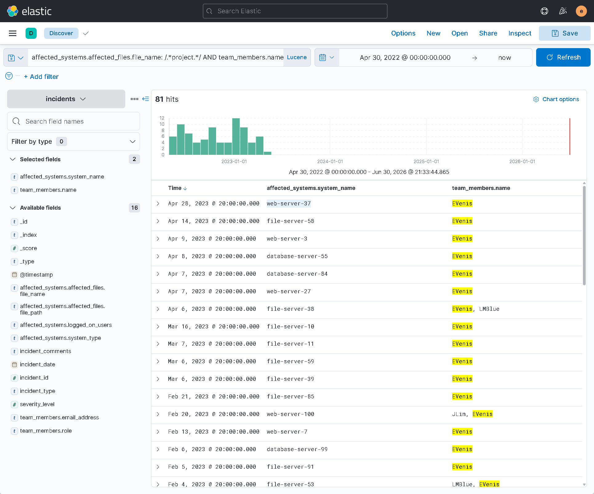

Reviewer takeaway:

Lucene regex can be combined with analyst or team-member fields, then sorted to identify the latest affected system.

Query evidence:

| Pattern | Exact query | Result |
|---|---|---|
| Lucene regex plus analyst pivot | `affected_systems.affected_files.file_name: /.*project.*/ AND team_members.name: "EVenis"` | 81 hits; latest affected system web-server-37 |

### 6. Numeric range filtering

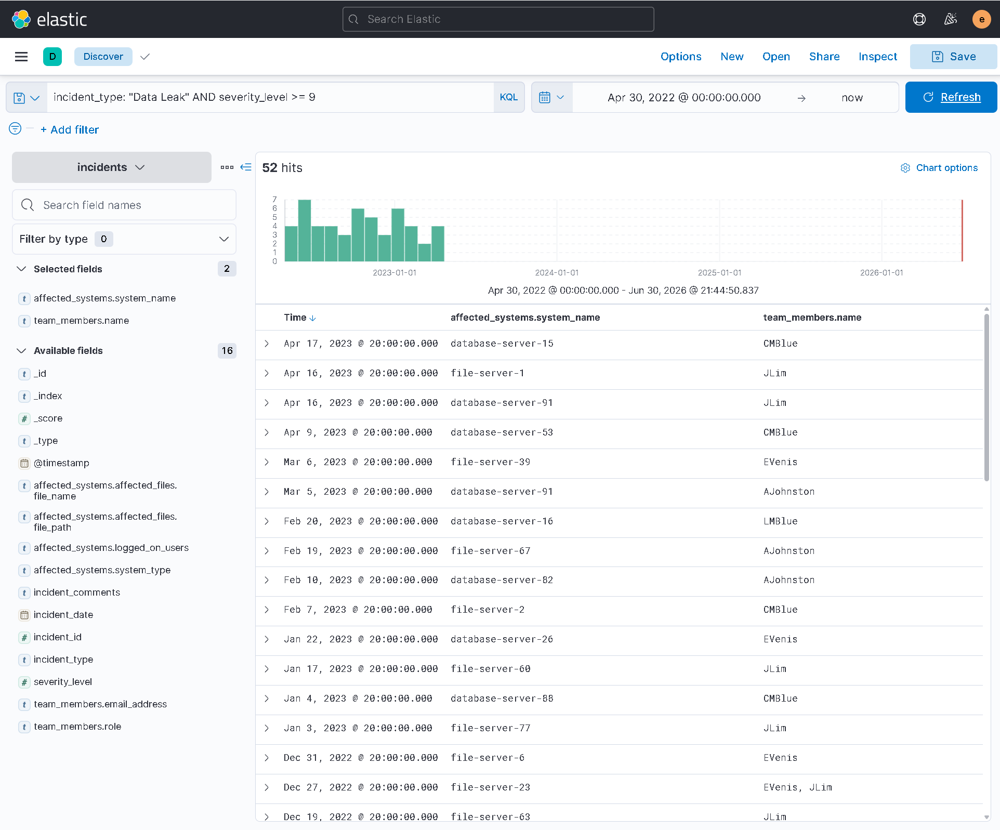

Reviewer takeaway:

Range filtering supports severity-based triage and prioritization.

Query evidence:

| Pattern | Exact query | Result |
|---|---|---|
| KQL numeric range | `incident_type: "Data Leak" AND severity_level >= 9` | 52 hits |

### 7. Date boundary and asset-type filtering

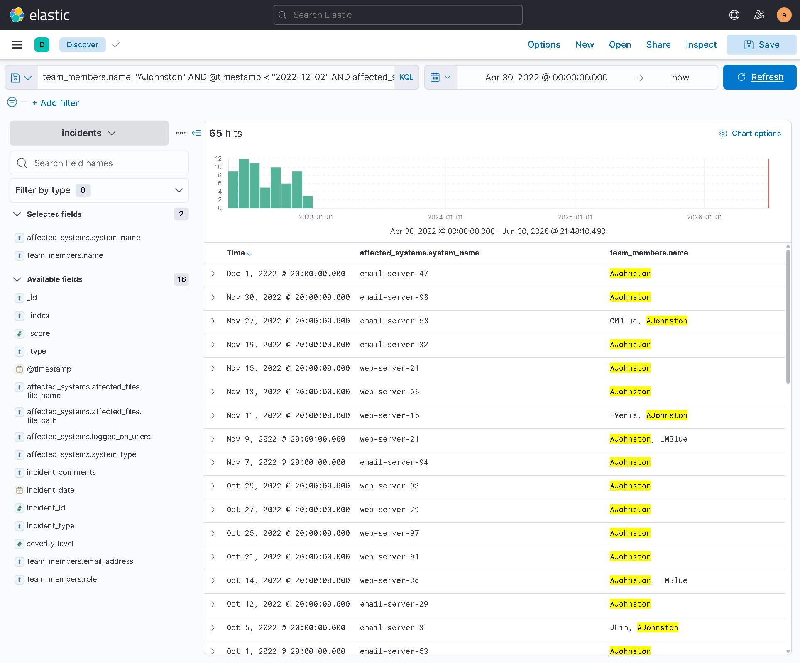

Reviewer takeaway:

Date constraints and OR logic help focus investigation scope around time and asset type.

Query evidence:

| Pattern | Exact query | Result |
|---|---|---|
| KQL date boundary and asset-type filtering | `team_members.name: "AJohnston" AND @timestamp < "2022-12-02" AND affected_systems.system_type: ("Email Server" OR "Web Server")` | 65 hits |

### 8. Incident-ID range and analyst comment evidence

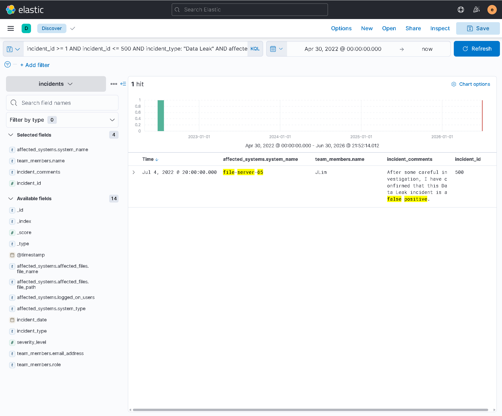

Reviewer takeaway:

Bounded ID ranges and comment evidence can identify who made a determination and why.

Query evidence:

| Pattern | Exact query | Result |
|---|---|---|
| KQL incident-ID range and analyst comment evidence | `incident_id >= 1 AND incident_id <= 500 AND incident_type: "Data Leak" AND affected_systems.system_name: "file-server-65" AND incident_comments: "false positive"` | 1 hit; analyst JLim |

### 9. Lucene fuzzy search

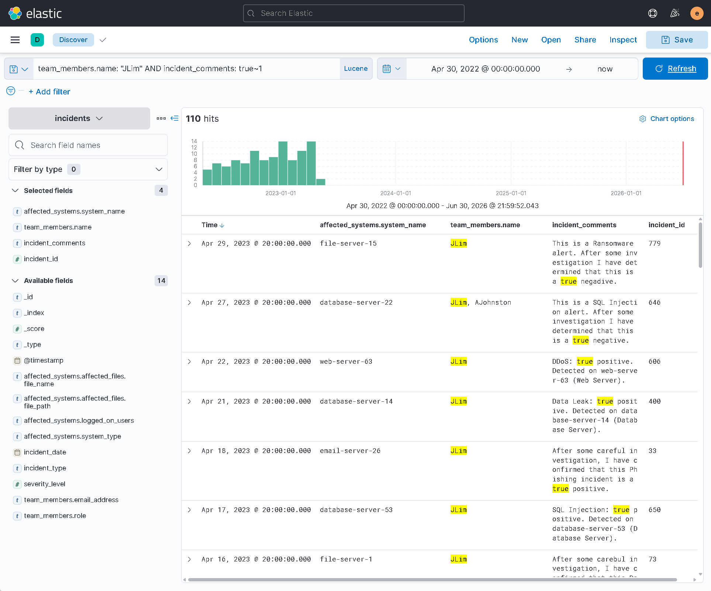

Reviewer takeaway:

Fuzzy search helps locate one-character variants or near matches in analyst notes.

Query evidence:

| Pattern | Exact query | Result |
|---|---|---|
| Lucene fuzzy search | `team_members.name: "JLim" AND incident_comments: true~1` | 110 hits |

### 10. Lucene proximity search

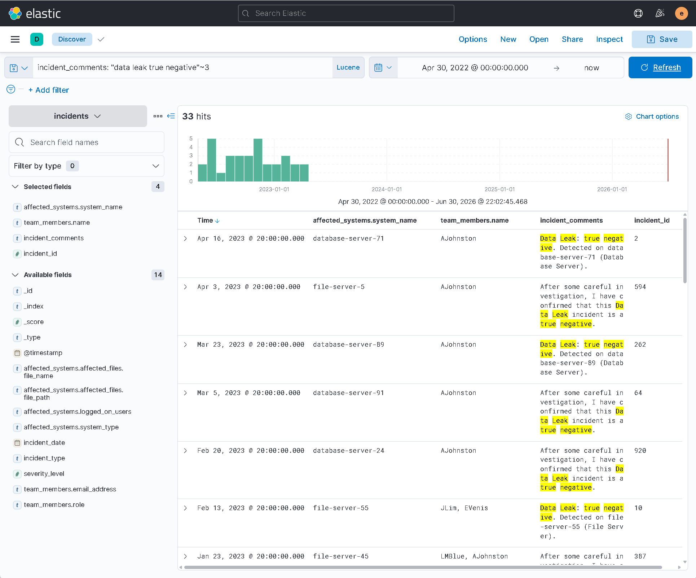

Reviewer takeaway:

Proximity search finds related terms near each other without requiring exact phrase matching.

Query evidence:

| Pattern | Exact query | Result |
|---|---|---|
| Lucene proximity search | `incident_comments: "data leak true negative"~3` | 33 hits |

### 11. Proximity search with analyst filter

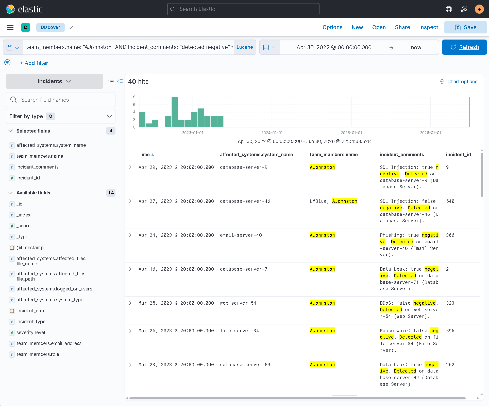

Reviewer takeaway:

Proximity search can be combined with analyst ownership to narrow a search to a specific review context.

Query evidence:

| Pattern | Exact query | Result |
|---|---|---|
| Lucene proximity search with analyst filter | `team_members.name: "AJohnston" AND incident_comments: "detected negative"~2` | 40 hits |

## Technical source

| File | Purpose |
|---|---|
| [queries/section-03-kql-lucene-queries.md](../queries/section-03-kql-lucene-queries.md) | Exact KQL and Lucene query ledger. |

## Complete evidence reference

| Screenshot | What it proves |
|---|---|
| 18-kibana-incidents-exact-file-name-kql-filter.png | Exact nested-field KQL filtering. |
| 19-kibana-incidents-file-server-marketing-strategy-wildcard-kql-filter.png | KQL wildcard and asset-type filtering. |
| 20-kibana-incidents-web-server-true-positive-admin-it-kql-filter.png | Boolean and nested-field investigation pivot. |
| 21-kibana-incidents-ransomware-comment-client-list-lucene-regex-filter.png | Lucene regex against analyst comments and file names. |
| 22-kibana-incidents-project-file-evenis-latest-system-lucene-regex-filter.png | Regex plus analyst pivot and newest-result extraction. |
| 23-kibana-incidents-data-leak-severity-range-kql-filter.png | Numeric range filtering. |
| 24-kibana-incidents-ajohnston-email-web-server-date-range-kql-filter.png | Date boundary and asset-type filtering. |
| 25-kibana-incidents-id-range-file-server-65-false-positive-kql-filter.png | Incident-ID range and analyst comment evidence. |
| 26-kibana-incidents-jlim-true-fuzzy-lucene-filter.png | Lucene fuzzy search. |
| 27-kibana-incidents-data-leak-true-negative-proximity-lucene-filter.png | Lucene proximity search. |
| 28-kibana-incidents-ajohnston-detected-negative-proximity-lucene-filter.png | Proximity search combined with analyst filter. |

## Analyst lessons

- KQL is effective for fast structured filtering, ranges, boolean logic, and wildcard matching.
- Lucene is useful for regex, fuzzy, and proximity searches.
- Result counts depend on the selected field, time range, and intended evidence source.
- Selected columns make investigation screenshots easier to review.
- Structured fields and analyst comment text are not interchangeable evidence sources.
- A SIEM is only useful if the analyst can ask precise questions against indexed data.

## Reviewer takeaway

This section proves practical Elastic query fluency across exact filtering, wildcard matching, boolean pivots, ranges, regex, fuzzy search, proximity search, and field-source validation.