# Section 04 - Slingshot Attack Reconstruction

[README](../README.md) | [Docs Index](README.md) | [Proof Map](../reviewer-proof-map.md)

## Purpose

This section demonstrates applied SOC investigation and attack reconstruction using Apache log evidence in Elastic.

Workflow proven:

| Step | Analyst value |
|---|---|
| Field discovery | Identify which indexed fields are useful for pivots. |
| Source identification | Determine attacker source using field statistics. |
| User-agent analysis | Infer scanner, enumeration, brute-force, and browser-like behavior. |
| Enumeration review | Count failed probes and identify successful path discovery. |
| Authentication review | Separate failed brute-force attempts from successful login evidence. |
| Post-login activity | Track upload behavior and uploaded file access. |
| Command execution review | Identify first observed web shell command. |
| LFI review | Trace path traversal and target configuration-file access. |
| Database access review | Identify phpMyAdmin database and table access. |
| Timeline building | Convert isolated events into a defensible incident narrative. |

## Evidence summary

The investigation followed attacker behavior from scanning and directory enumeration through brute-force authentication, admin access, file upload, web shell execution, LFI-style access to a phpMyAdmin configuration file, and phpMyAdmin database/table access.

The public artifact uses sanitized evidence. Sensitive authentication material, credential-bearing values, expanded request bodies, and private exercise artifacts are excluded.

## Visual walkthrough

### 1. Initial field discovery

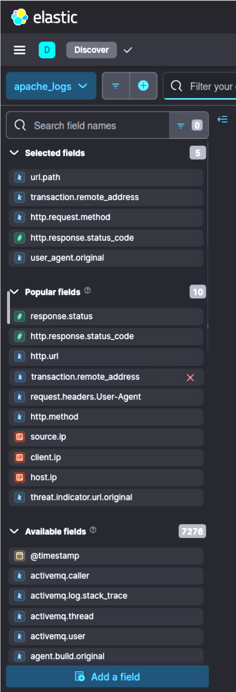

Reviewer takeaway:

The investigation began by identifying useful pivot fields for source address, URL path, HTTP method, status code, and user agent.

Visible fields included:

| Field | Investigation use |
|---|---|
| `transaction.remote_address` | Useful attacker source field. |
| `url.path` and `http.url` | Path and endpoint pivots. |
| `http.request.method` | GET/POST behavior review. |
| `http.response.status_code` and `response.status` | Success, failure, and discovery indicators. |
| `user_agent.original` and `request.headers.User-Agent` | Tool and client behavior analysis. |

### 2. Attacker source identification

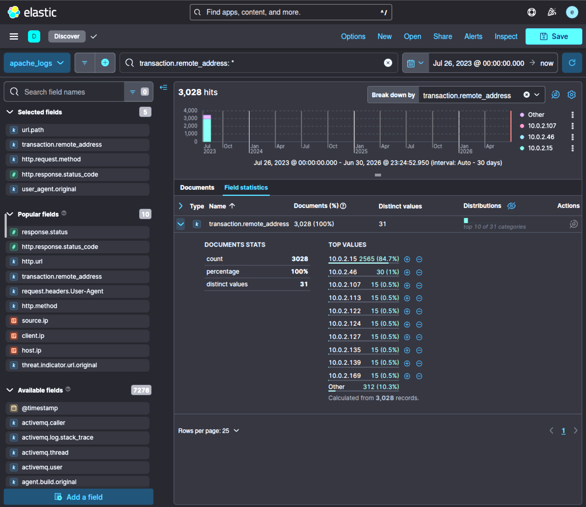

Reviewer takeaway:

The attacker source was identified through field-statistics dominance, not assumption.

Evidence summary:

| Evidence | Value |
|---|---|
| Data view | `apache_logs` |
| Field statistic | `transaction.remote_address` |
| Total records | 3,028 |
| Distinct remote addresses | 31 |
| Dominant remote address | `10.0.2.15` |
| Dominant source volume | 2,565 events, 84.7 percent |

Conclusion:

| Finding | Value |
|---|---|
| Attacker IP | `10.0.2.15` |

### 3. Tooling sequence from user-agent evidence

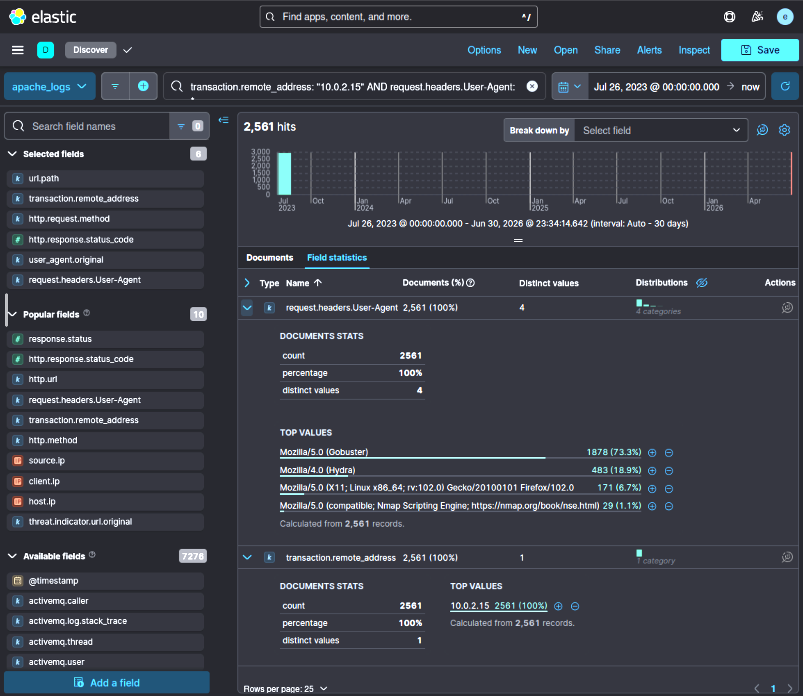

Reviewer takeaway:

User-agent distribution produced a fast attacker-tool timeline.

Evidence summary:

| User-Agent evidence | Investigation meaning |
|---|---|
| Nmap Scripting Engine | Initial scanning behavior. |
| Gobuster | Directory enumeration behavior. |
| Hydra | Brute-force authentication behavior. |
| Firefox-like client | Browser-like post-authentication activity. |

Analyst lesson:

User-agent statistics can rapidly separate scanning, enumeration, brute-force, and interactive web activity.

### 4. Attacker 404 response count

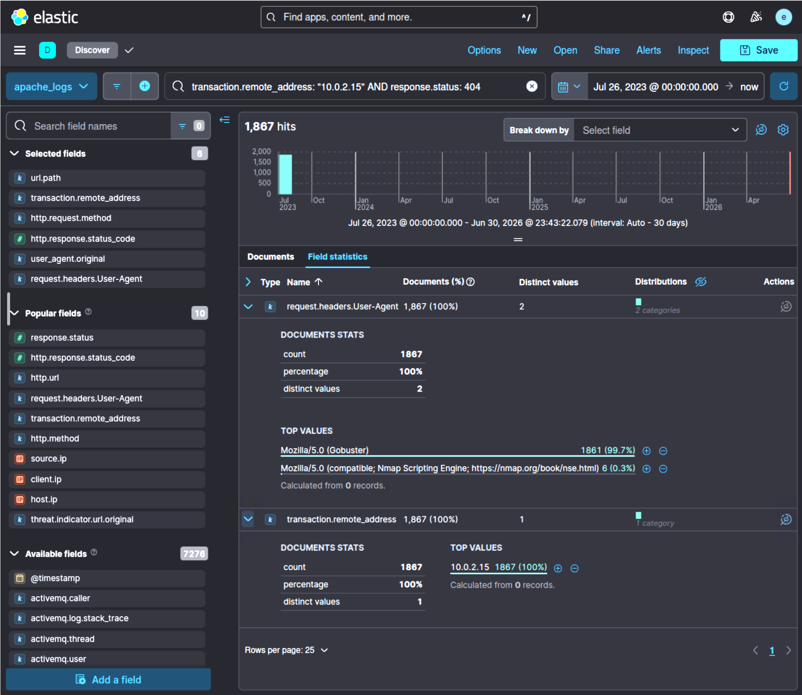

Reviewer takeaway:

The accepted count required all attacker 404 responses, not only Gobuster 404 responses.

Evidence summary:

| Query focus | Result |
|---|---|
| All attacker 404 responses | 1,867 hits |
| Gobuster share of 404 responses | 1,861 hits |
| Nmap-style share of 404 responses | 6 hits |

Analyst lesson:

Counting scope matters. Tool-specific counts and attacker-wide counts can differ.

### 5. Gobuster non-404 path discovery

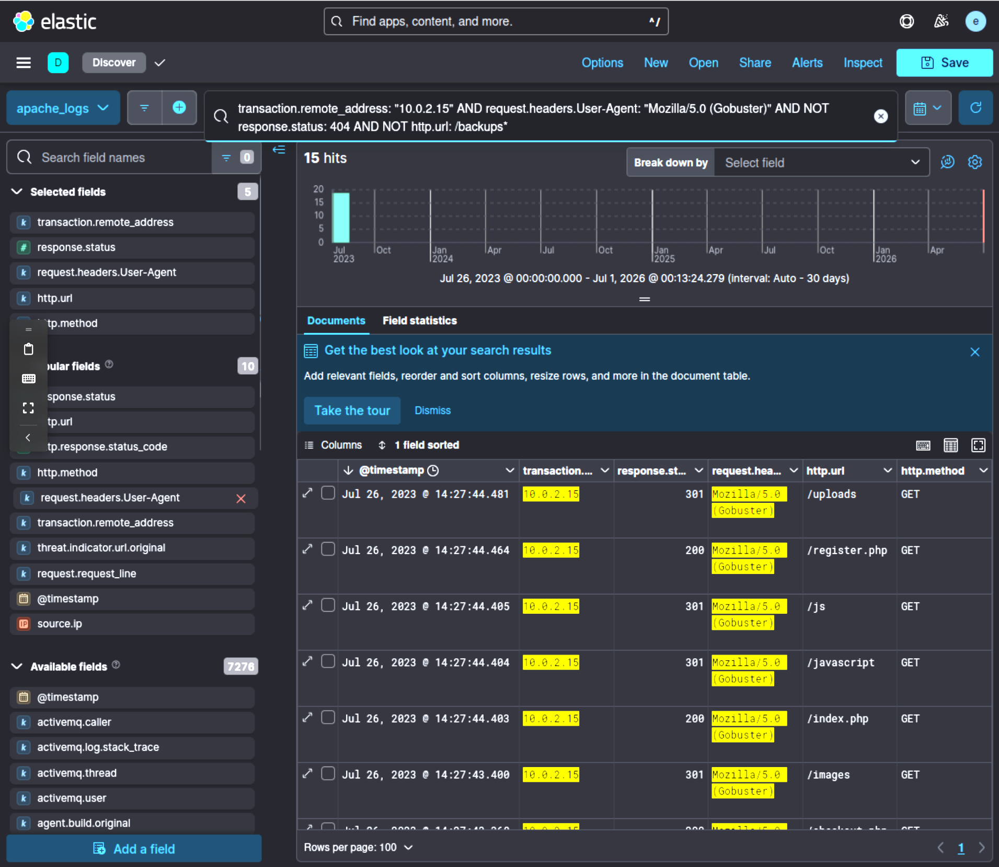

Reviewer takeaway:

Gobuster enumeration was reviewed through non-404 responses to identify successful path discovery while excluding sensitive artifacts.

Visible public-safe paths included:

| Path evidence | Meaning |
|---|---|
| `/uploads` | Upload-accessible path. |
| `/register.php` | Application endpoint. |
| `/js` | Static resource path. |
| `/javascript` | Static resource path. |
| `/index.php` | Application entry point. |
| `/images` | Static resource path. |

### 6. Admin-login discovery through behavior

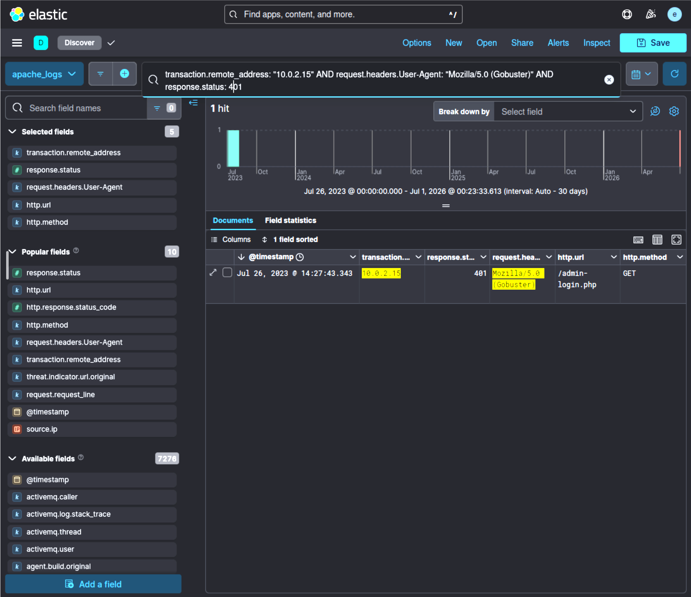

Reviewer takeaway:

The protected admin-login page was proven through Gobuster behavior and a 401 response rather than a direct answer-specific search.

Evidence summary:

| Evidence | Value |
|---|---|
| Attacker IP | `10.0.2.15` |
| Tool | Gobuster |
| Response status | 401 |
| Path | `/admin-login.php` |
| Timestamp | Jul 26, 2023 @ 14:27:43.343 |

Conclusion:

| Finding | Value |
|---|---|
| Protected admin login page | `/admin-login.php` |

### 7. Hydra brute-force activity

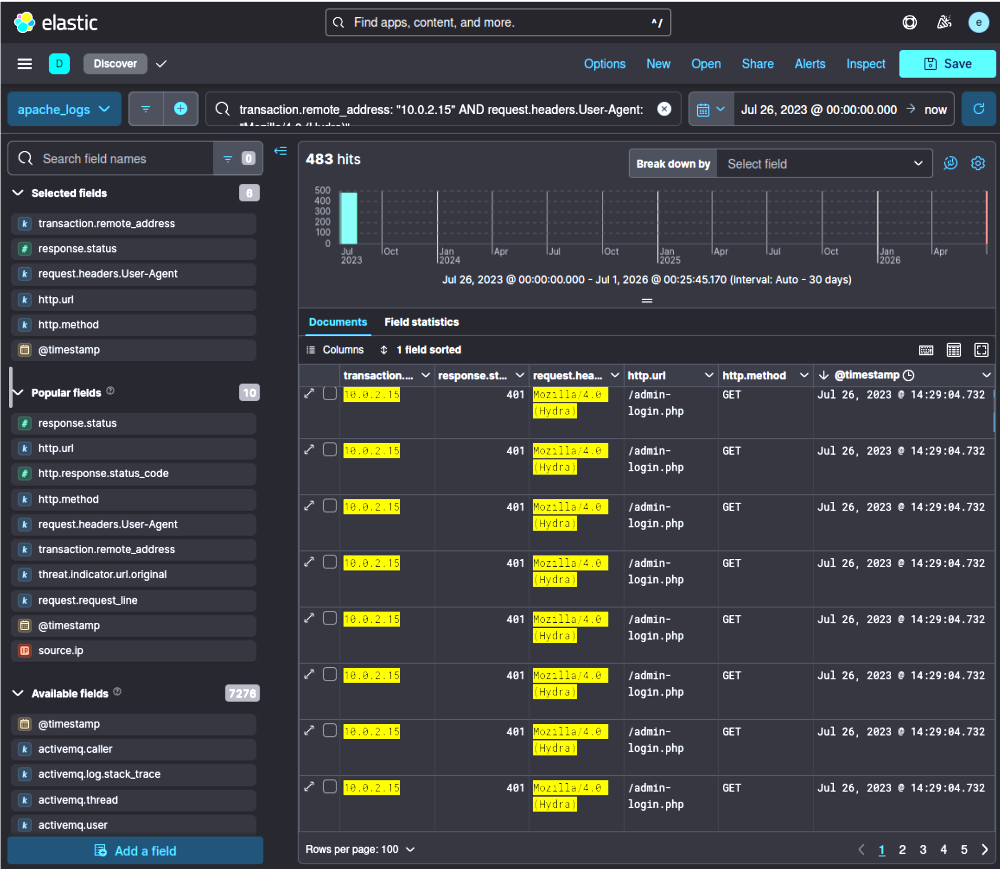

Reviewer takeaway:

Hydra activity showed repeated authentication attempts against the admin panel.

Evidence summary:

| Evidence | Value |
|---|---|
| Attacker IP | `10.0.2.15` |
| User-Agent | `Mozilla/4.0 (Hydra)` |
| Target path | `/admin-login.php` |
| Common response | 401 |
| Request count | 483 hits |

Conclusion:

Hydra was used to brute-force the admin panel.

### 8. Sanitized successful login evidence

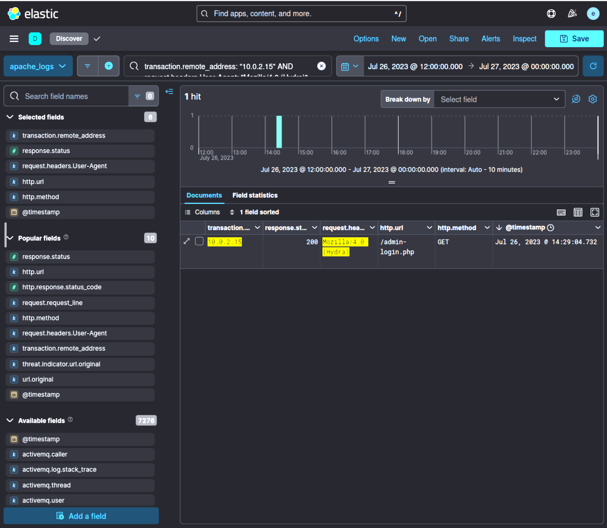

Reviewer takeaway:

Repeated 401 responses showed failed attempts, while a sanitized 200 response showed successful authentication without exposing sensitive authentication material.

Evidence summary:

| Evidence | Value |
|---|---|
| Attacker IP | `10.0.2.15` |
| User-Agent | `Mozilla/4.0 (Hydra)` |
| Target path | `/admin-login.php` |
| Response status | 200 |
| Sensitive authentication material | Excluded from public evidence |

Conclusion:

A successful admin login occurred after brute-force activity.

### 9. Post-login upload activity

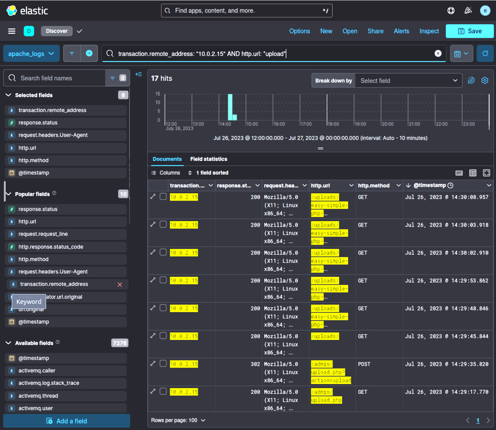

Reviewer takeaway:

After successful authentication, the attacker accessed the admin upload workflow and submitted an upload request.

Evidence summary:

| Evidence | Value |
|---|---|
| Upload endpoint | `/admin/upload.php?action=upload` |
| Request method | POST |
| Response status | 302 |
| Follow-on behavior | Access to uploaded path under `/uploads/` |

Analyst lesson:

Upload evidence is strongest when it shows the upload request followed by access to the uploaded file.

### 10. First observed web shell command

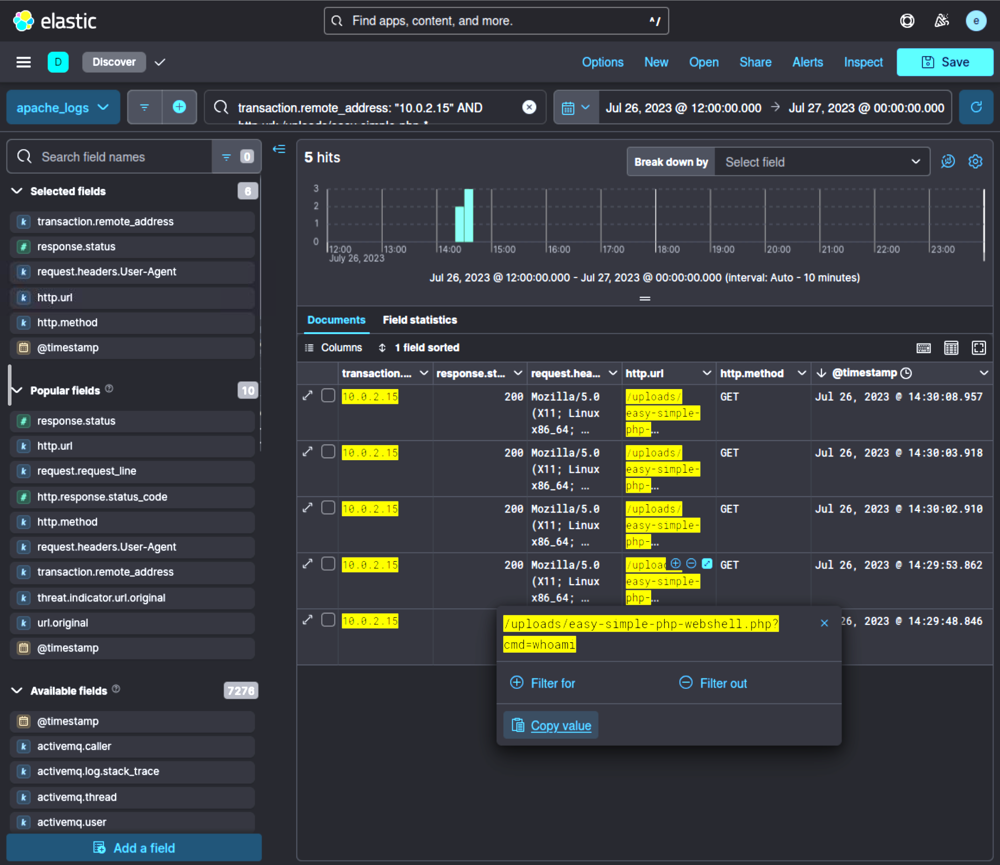

Reviewer takeaway:

The first observed command execution through the uploaded PHP path was identified.

Evidence summary:

| Evidence | Value |
|---|---|
| Uploaded path | `/uploads/easy-simple-php-*` |
| Query parameter | `cmd=whoami` |
| Response status | 200 |
| Timestamp | Jul 26, 2023 @ 14:29:48.846 |

Conclusion:

| Finding | Value |
|---|---|
| First observed command | `whoami` |

### 11. LFI-style access to config-db.php

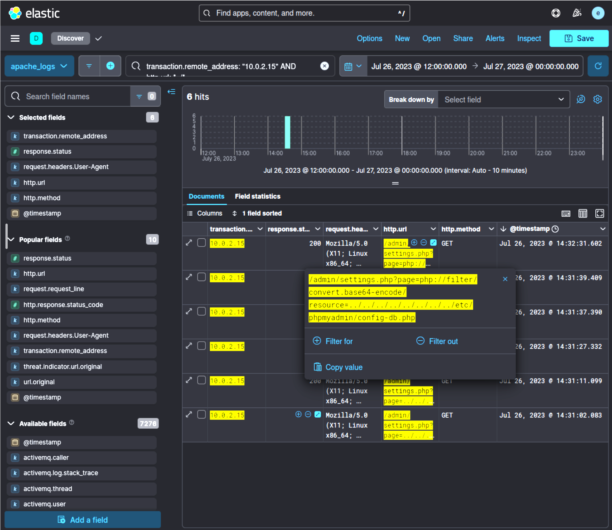

Reviewer takeaway:

The investigation traced LFI-style path traversal to a phpMyAdmin configuration file without exposing recovered secret values.

Evidence summary:

| Evidence | Value |
|---|---|
| Vulnerable path | `/admin/settings.php` |
| Access pattern | `php://filter/convert.base64-encode/resource=` |
| Traversal target | `../../../../etc/phpmyadmin/config-db.php` |
| Response status | 200 |
| Timestamp | Jul 26, 2023 @ 14:31:39.409 |

Conclusion:

| Finding | Value |
|---|---|
| LFI target file | `config-db.php` |

### 12. phpMyAdmin database and table access

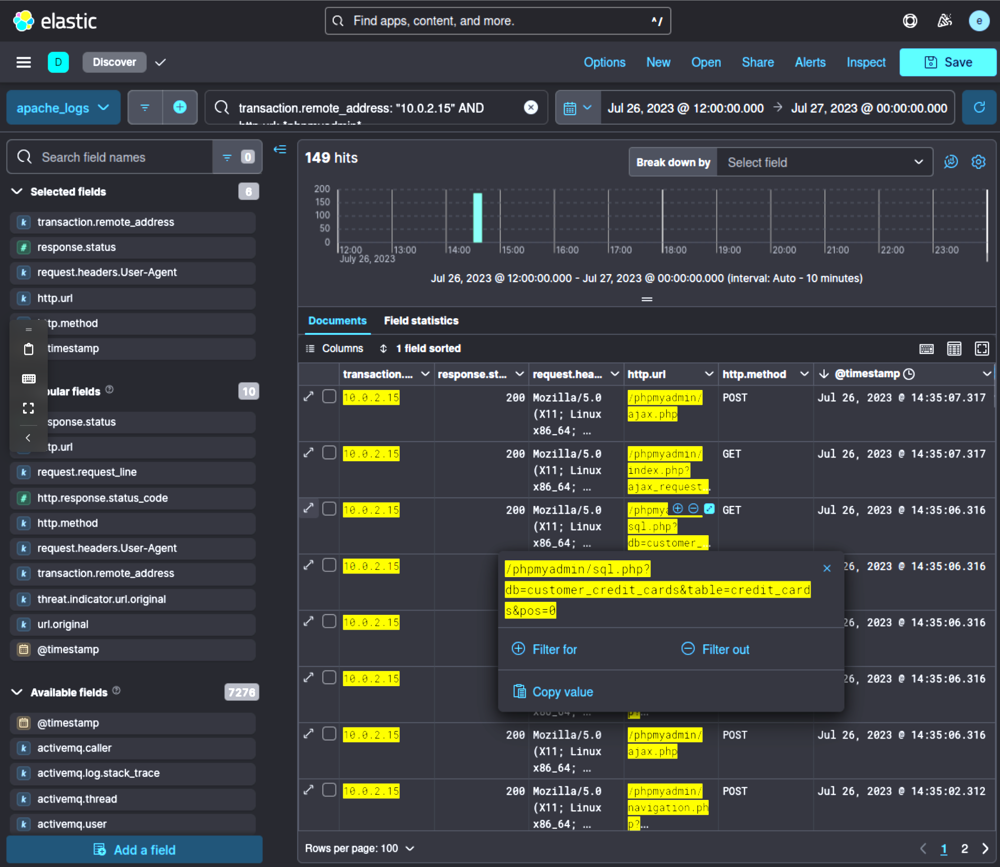

Reviewer takeaway:

The investigation identified phpMyAdmin database and table access after the LFI activity.

Evidence summary:

| Evidence | Value |
|---|---|
| Path family | `/phpmyadmin` |
| Database | `customer_credit_cards` |
| Table | `credit_cards` |
| Response status | 200 |
| Timestamp | Jul 26, 2023 @ 14:35:06.316 |

Conclusion:

The attacker accessed phpMyAdmin and interacted with the `customer_credit_cards` database and `credit_cards` table.

Scope note:

This screenshot proves database and table access. It is not presented as proof of an export-specific endpoint.

## Technical source

| File | Purpose |
|---|---|
| [queries/section-04-slingshot-investigation-queries.md](../queries/section-04-slingshot-investigation-queries.md) | Exact Elastic investigation query ledger. |

## Attack timeline

| Time | Evidence-backed activity |
|---|---|
| Jul 26, 2023 @ 14:27:43 | Gobuster discovers `/admin-login.php` via a 401 response. |
| Jul 26, 2023 @ 14:27:44 to 14:27:45 | Gobuster identifies non-404 paths including `/uploads`, `/register.php`, `/js`, `/javascript`, `/index.php`, and `/images`. |
| Jul 26, 2023 @ 14:29:04 | Hydra brute-force activity targets `/admin-login.php`. Most attempts return 401. |
| Jul 26, 2023 @ 14:29:04 | One Hydra request returns 200, indicating successful authentication. Sensitive authentication material is excluded from public evidence. |
| Jul 26, 2023 @ 14:29:17 to 14:29:35 | Attacker accesses `/admin/upload.php` and submits `/admin/upload.php?action=upload`. |
| Jul 26, 2023 @ 14:29:48 | Attacker accesses an uploaded PHP path under `/uploads/` and runs `cmd=whoami`. |
| Jul 26, 2023 @ 14:31:02 to 14:32:31 | Attacker performs LFI-style path traversal through `/admin/settings.php`. |
| Jul 26, 2023 @ 14:31:39 | Attacker uses `php://filter` with path traversal to read `/etc/phpmyadmin/config-db.php`. |
| Jul 26, 2023 @ 14:35:06 | Attacker accesses phpMyAdmin database `customer_credit_cards` and table `credit_cards`. |

## Key findings

| Finding | Value |
|---|---|
| Attacker IP | `10.0.2.15` |
| Dominant source volume | 2,565 of 3,028 events |
| Directory enumeration tool | Gobuster |
| Brute-force tool | Hydra |
| Admin login page | `/admin-login.php` |
| Upload endpoint | `/admin/upload.php?action=upload` |
| First observed web shell command | `whoami` |
| LFI target | `config-db.php` |
| Database | `customer_credit_cards` |
| Table | `credit_cards` |

## Complete evidence reference

| Screenshot | What it proves |
|---|---|
| 29-kibana-slingshot-apache-logs-initial-scope-field-discovery.png | Initial field discovery for Apache log investigation. |
| 30-kibana-slingshot-remote-address-distribution-attacker-identification.png | Attacker IP identification through field statistics. |
| 31-kibana-slingshot-attacker-user-agent-scanner-identification.png | Tooling sequence from user-agent distribution. |
| 32-kibana-slingshot-attacker-404-response-count.png | Attacker 404 response count during enumeration. |
| 33-kibana-slingshot-gobuster-discovered-paths-non-404.png | Successful directory discovery evidence. |
| 34-kibana-slingshot-gobuster-admin-login-page-discovery.png | Admin-login discovery through Gobuster and 401 response. |
| 35-kibana-slingshot-hydra-admin-panel-bruteforce-evidence.png | Hydra brute-force activity. |
| 36-kibana-slingshot-hydra-successful-admin-login-sanitized.png | Sanitized successful login evidence. |
| 37-kibana-slingshot-admin-upload-activity.png | Post-login upload activity. |
| 38-kibana-slingshot-first-web-shell-command.png | First observed web shell command. |
| 39-kibana-slingshot-lfi-config-db-file-access.png | LFI-style access to `config-db.php`. |
| 40-kibana-slingshot-phpmyadmin-customer-credit-cards-database-access.png | phpMyAdmin database and table access. |

## Analyst lessons

- Field discovery matters before querying. Some expected source fields may not be populated.
- Attacker identification should be supported by distribution evidence.
- User-agent statistics can quickly reveal a tool timeline.
- Counting scope matters. Tool-specific counts and attacker-wide counts can differ.
- Behavioral proof is stronger than direct searches for known endpoint names.
- Sensitive authentication material should be excluded from public evidence.
- Attack reconstruction requires ordering individual evidence points into a defensible timeline.

## Reviewer takeaway

This section proves applied SOC investigation discipline: field discovery, evidence-based attacker identification, tooling pivots, brute-force validation, post-login activity tracking, LFI analysis, database-access evidence, and timeline construction.